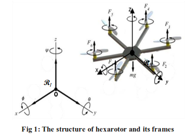
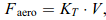

# Mathematical-Modeling-of-Hexacopter
Dynamic Equations of Hexacopter explained in detail

Step-1: Choosing Configuration

The orientation given by three Euler angles [phi, theta, psi] where (-pi/2 < phi,theta < pi/2) and (-pi < psi <pi)

Step-2: Forces and Torques acting on body
Forces:
1) Thrust force
2) Gravity force
3) Drag force
4) Disturbance(Other forces like the Coriolis force from the earth, the wind and Euler forces are considered as a disturbance)

Torques:
1) Thrust moment 
2) Motors inertia moment
3) Aerodynamic moment
4) Disturbances moment

step-3: Dynamic Equations

Refer Dr.Atilla Dogan's: 

1) Translational Dynamics:

2) Rotational Dynamics:

theta not equal to pi/2+pi*k, k belongs to integers

Reference: https://journals.sagepub.com/doi/pdf/10.1177/1729881417738103
